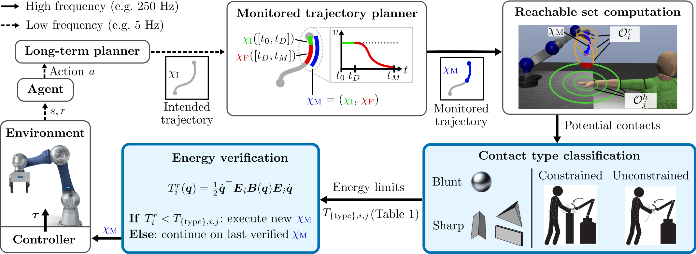
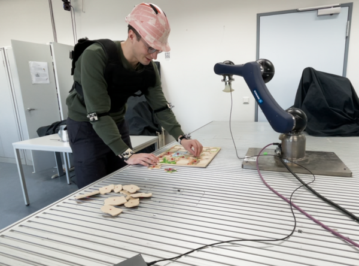
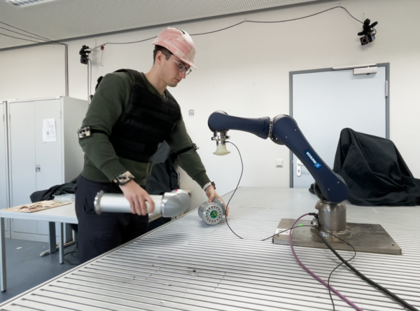
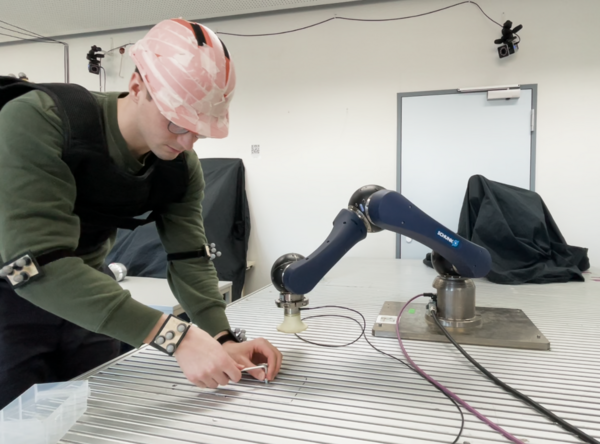
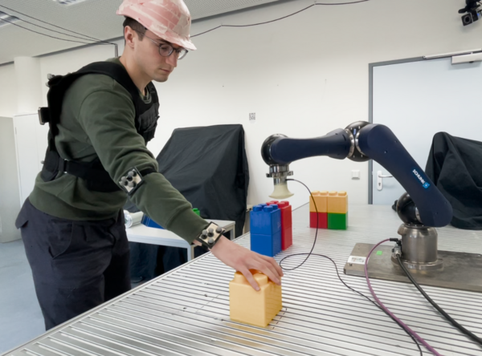
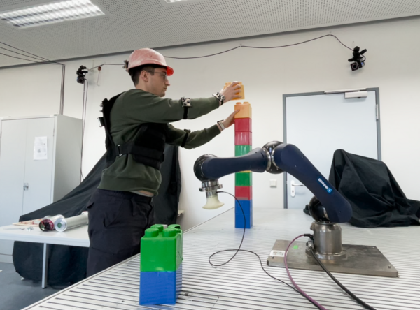

# SARA shield

[](https://opensource.org/licenses/MIT)
[](http://arxiv.org/abs/2412.10180)
[](#coverage-report)
[](#coverage-report)

SARA shield is a safety framework for human-robot interaction that gives **formal safety guarantees** while allowing fast robot speeds.
It implements the **S**afe **A**utonomous human-**r**obot collaboration through **R**eachability **A**nalysis (SARA) shield introduced in our IEEE Transactions on Robotics paper *"A General Safety Framework for Autonomous Manipulation in Human Environments"*.

In every control cycle, SARA shield computes the reachable sets of the human and the robot, classifies all possible contacts by collision type, and verifies that the kinetic energy of the robot stays below human pain and injury thresholds. If a desired motion cannot be verified, the shield slows the robot down along a path-consistent failsafe trajectory.

> **Naming.** *SARA shield* is the safety framework in this repository. It uses [SaRA](https://github.com/Sven-Schepp/SaRA), a separate reachability analysis library, to compute reachable occupancies. The two are distinct: SaRA provides the reachable sets, SARA shield uses them for safe trajectory control.

## Contents

- [Demos](#demos)
- [How it works](#how-it-works)
- [Installation](#installation)
- [Quick start](#quick-start)
- [Configuration](#configuration)
- [Benchmark tasks](#benchmark-tasks)
- [Testing](#testing)
- [Citation](#citation)
- [Related publications](#related-publications)
- [License](#license)

## Demos

SARA shield comes in two major modes of operation:
 - **SSM** (speed and separation monitoring) stops the robot before the human can reach it. 
 - **PFL** (power and force limiting) permits contact as long as the robot energy stays below injury limits, which keeps the robot productive while the human is close.

| Scenario | SSM (stop before contact) | PFL (SARA shield) |
| --- | --- | --- |
| Close-contact clamping | <video src="https://github.com/user-attachments/assets/4cae9f82-639a-4053-bec6-47631632a615" width="406" controls></video> | <video src="https://github.com/user-attachments/assets/2d4e413f-bf5d-48fa-aa41-72271cfe088d" width="406" controls></video> |
| RobCo assembly task | <video src="https://github.com/user-attachments/assets/39a68134-cffe-4d72-8916-3cb7fba72ecc" width="406" controls></video> | <video src="https://github.com/user-attachments/assets/a1677376-0fc9-453d-8f45-4c6941382dcb" width="406" controls></video> |

In our real-world experiments, SARA shield completes collaborative tasks 15.9 % faster than the best-performing state-of-the-art approach while keeping the contact energy below injury thresholds.

## How it works



SARA shield wraps the robot controller and verifies every motion before it is executed:

1. **Long-term planner.** Take in a joint position goal, e.g., from a motion planner, and translate it to an $\color{green}{\textsf{intended trajectory}}$ with a the `sample_time`, e.g., 4ms, of SARA shield.
2. **Monitored trajectory planner.** The shield combines one timestep of the $\color{green}{\textsf{intended trajectory}}$ with a $\color{red}{\textsf{failsafe trajectory}}$ that brings the robot to a stop, forming the $\color{#3b82f6}{\textsf{monitored trajectory}}$.
3. **Reachable set computation.** Using reachability analysis (SaRA), the shield computes the sets of all states the human and the robot can occupy over the trajectory horizon.
4. **Contact type classification.** (Only in PFL mode) Potential contacts are classified as *constrained* (clamping) or *unconstrained*, and by the contacting geometry, since unconstrained contacts tolerate far higher forces.
5. **Energy verification.** (Only in PFL mode) The shield checks that the kinetic energy of the robot stays below the pain and injury limits for the detected contact type and human body part. If verification succeeds, the $\color{#3b82f6}{\textsf{monitored trajectory}}$ is executed; otherwise the robot continues on the last verified $\color{#3b82f6}{\textsf{monitored trajectory}}$.

Because the robot is initially at rest and every executed trajectory ends in a stopped state, safety holds indefinitely by induction.

## Installation

Clone the repository with its submodules:

```bash
git clone --recurse-submodules git@github.com:TUMcps/sara-shield.git
cd sara-shield
```

The build requires `gcc`, a C++17 compiler, and [Eigen3](https://eigen.tuxfamily.org) version 3.4. Point the following environment variable to your Eigen installation:

```bash
export EIGEN3_INCLUDE_DIR="/usr/include/eigen3/eigen-3.4.0"
```

### C++ library

Install GoogleTest, then build with CMake:

```bash
sudo apt-get install libgtest-dev
cd safety_shield
mkdir build && cd build
cmake ..
make -j 4
```

### Python bindings

The Python package builds through `scikit-build-core` and installs the `safety_shield_py` module:

```bash
pip install .
```

## Quick start

The example below constructs a shield for the Franka Emika Panda and runs one verified control step. See [`safety_shield/tests/bindings/test_safety_shield.py`](safety_shield/tests/bindings/test_safety_shield.py) for the full API.

```python
from safety_shield_py import SafetyShield, ShieldType, ContactType, AABB

# Static obstacle: a table modeled as an axis-aligned bounding box.
table = AABB([-1.0, -1.0, -0.1], [1.0, 1.0, 0.0])

shield = SafetyShield(
    sample_time=0.004,
    trajectory_config_file="safety_shield/config/trajectory_parameters_panda.yaml",
    robot_config_file="safety_shield/config/robot_parameters_panda.yaml",
    mocap_config_file="safety_shield/config/cmu_mocap_no_hand.yaml",
    init_x=0.0, init_y=0.0, init_z=0.0,
    init_roll=0.0, init_pitch=0.0, init_yaw=0.0,
    init_qpos=[0.0] * 7,
    environment_elements=[table],
    shield_type=ShieldType.SSM,
    eef_contact_type=ContactType.EDGE,
)

# Control loop (run every sample_time seconds):
t = 0.004
shield.humanMeasurement([[0.0, 0.0, 0.0]] * 21, t)   # measured human joint positions + timestamp
shield.newLongTermTrajectory(goal_qpos, goal_qvel)    # intended trajectory from the agent
motion = shield.step(t)                               # safe joint motion to send to the controller
is_safe = shield.getSafety()                          # True if the intended motion was verified safe
```

`shield_type` selects `ShieldType.SSM` (stop before contact) or `ShieldType.PFL` (energy-limited contact). `eef_contact_type` declares the geometry of the end effector for contact classification.

## Configuration

System parameters are defined in YAML files in [`safety_shield/config/`](safety_shield/config/), grouped into three categories:

- **`robot_parameters_*.yaml`** — robot kinematics, capsule geometry, and dynamic parameters.
- **`trajectory_parameters_*.yaml`** — velocity, acceleration, and jerk limits used for trajectory planning.
- **Human reach configs** (`cmu_mocap_*.yaml`, `human_reach_*.yaml`) — human body-part models and maximum body-part velocities.

Configurations are provided for the following robots: **iiwa**, **jaco**, **kinova3**, **modrob**, **panda**, **sawyer**, **schunk**, and **ur5e**.

### Deploying SARA shield on your own setup

The safety guarantees of SARA shield depend on a small set of assumptions about your robot, your sensing pipeline, the human, and the environment (Section III.D of [the paper](http://arxiv.org/abs/2412.10180)). To deploy on a new setup, copy an existing config of a similar robot and adapt the keys below.

**`robot_parameters_<robot>.yaml`** — robot kinematics, geometry, and dynamics. If you have a URDF and mesh files for your robot, the helper script [`safety_shield/scripts/urdf_capsule_generation.py`](safety_shield/scripts/urdf_capsule_generation.py) generates a draft of this file (and the trajectory parameters) by fitting a capsule to each link mesh:

```bash
python safety_shield/scripts/urdf_capsule_generation.py \
    --urdf_file my_robot.urdf \
    --stl_folder meshes/ \
    --robot_name my_robot \
    --number_joints 7 \
    --secure_radius 0.02 \
    --export
```

Keys to set or verify:

- `nb_joints` — number of joints.
- `transformation_matrices` — 4×4 homogeneous transforms between successive joint frames, in row-major order.
- `tool_transformation_matrix` — transform from the last joint frame to the end-effector frame.
- `enclosures` — one capsule per link (two endpoints + radius) over-approximating the link geometry.
- `link_masses`, `link_inertias`, `link_centers_of_mass` — rigid-body dynamics for kinetic-energy verification. Motor masses must be lumped into the links (no joint elasticity).
- `secure_radius` — safety margin added to every robot capsule to absorb tracking error of the low-level controller. Set this conservatively, e.g., from reachset-conformance identification.

**`trajectory_parameters_<robot>.yaml`** — motion limits used by the failsafe and long-term planners:

- `q_min_allowed`, `q_max_allowed` — joint position limits.
- `v_max_allowed`, `a_max_allowed`, `j_max_allowed` — per-joint velocity, acceleration, and jerk limits used by the failsafe trajectory.
- `a_max_ltt`, `j_max_ltt` — looser limits used by the long-term planner.
- `max_s_stop` — maximum path-length scaling allowed before the failsafe stop must complete.
- `v_safe` — ISO-rated safe Cartesian speed for the SSM mode.
- `alpha_i_max` — bound on the maximum angular acceleration of any robot point.

**Human reach config** (`cmu_mocap_*.yaml` or `human_reach_*.yaml`) — human model and sensing pipeline:

- `joint_names` — names and order of the human joints reported by your sensing system.
- `joint_v_max`, `joint_a_max` — per-joint maximum velocity and acceleration of the human (e.g., from DIN 33402-2:2020-12 and DIN EN ISO 13855:2010).
- `bodies` and `extremities` — capsule definition (`proximal`, `distal`, `thickness`) of every modeled body part and its `max_contact_energy` under `constrained` and `unconstrained` contact, per end-effector geometry (`blunt`, `wedge`, `edge`, `sheet`, `link`).
- `unclampable_body_parts` — pairs of body parts that cannot clamp each other (anatomical topology); reduces conservatism.
- `measurement_error_pos`, `measurement_error_vel`, `delay` — conservative upper bounds on the position and velocity measurement error and the time delay of your human-sensing pipeline (motion capture, lidar, depth camera).
- `use_kalman_filter`, `s_w`, `s_v`, `initial_pos_var`, `initial_vel_var` — Kalman filter for measurement smoothing.

**`SafetyShield` constructor** — runtime state of the cell:

- `environment_elements` — list of `AABB` (and similar) primitives over-approximating every static element that can cause clamping (walls, floor, table, fixtures).
- `sample_time` — control period of the shield (the example uses 4 ms). Your long-term planner must supply intended joint trajectories at this rate.
- `shield_type`, `eef_contact_type` — operating mode (`SSM`/`PFL`) and end-effector geometry for contact classification.

## Benchmark tasks

We evaluate SARA shield in an ablation study on five collaborative manipulation tasks:

| Puzzle | RobCo | Screwing | Stacking | Tower |
| --- | --- | --- | --- | --- |
|  |  |  |  |  |

The code to reproduce the ablation study is on the [`ablation-study`](https://github.com/TUMcps/sara-shield/tree/ablation-study) branch.

## Testing

C++ tests use GoogleTest and are built with CMake:

```bash
cd safety_shield/build
ctest --output-on-failure
```

Python binding tests use `pytest`:

```bash
pytest safety_shield/tests
```

### Coverage report

Configure the C++ build with `ENABLE_COVERAGE=ON` and run the `coverage` target. This requires `lcov`:

```bash
sudo apt-get install lcov
cd safety_shield
mkdir build && cd build
cmake -DENABLE_COVERAGE=ON ..
ctest && make coverage
```

The HTML report is written to `build/coverage/index.html`.

## Citation

If you use SARA shield in your research, please cite:

```bibtex
@article{thumm_2026_GeneralSafety,
  title   = {A General Safety Framework for Autonomous Manipulation in Human Environments},
  author  = {Thumm, Jakob and Balletshofer, Julian and Maglanoc, Leonardo and Muschal, Luis and Althoff, Matthias},
  journal = {IEEE Transactions on Robotics},
  year    = {2026},
  url     = {http://arxiv.org/abs/2412.10180}
}
```

## Related publications

- **SARA shield** — J. Thumm, J. Balletshofer, L. Maglanoc, L. Muschal, M. Althoff. *A General Safety Framework for Autonomous Manipulation in Human Environments.* IEEE Transactions on Robotics, 2026.
- **SaRA library** — S. Schepp, J. Thumm, S. B. Liu, M. Althoff. *SaRA: A Tool for Safe Human-Robot Coexistence and Collaboration through Reachability Analysis.* ICRA, 2022.
- **Provably safe RL** — J. Thumm, M. Althoff. *Provably Safe Deep Reinforcement Learning for Robotic Manipulation in Human Environments.* ICRA, 2022.
- **Human-Robot Gym** — J. Thumm, F. Trost, M. Althoff. *Human-Robot Gym: Benchmarking Reinforcement Learning in Human-Robot Collaboration.* ICRA, 2024.
- **PACS** — R. Römer, J. Balletshofer, J. Thumm, M. Pavone, A. P. Schoellig, M. Althoff. *From Demonstrations to Safe Deployment: Path-Consistent Safety Filtering for Diffusion Policies.* ICRA, 2026.
- **Human reachable occupancy** — A. Pereira, M. Althoff. *Overapproximative Human Arm Occupancy Prediction for Collision Avoidance.* IEEE T-ASE, 2018.

## License

SARA shield is released under the [MIT License](LICENSE).
